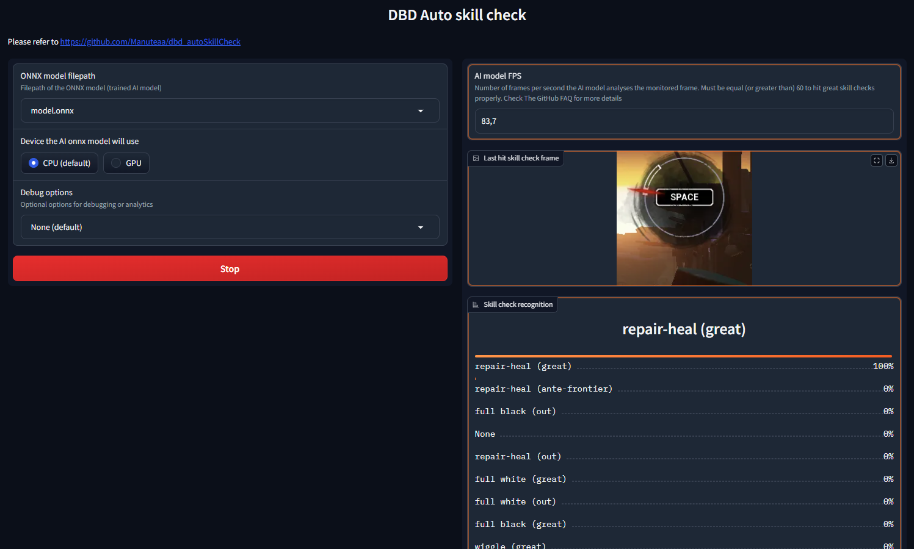
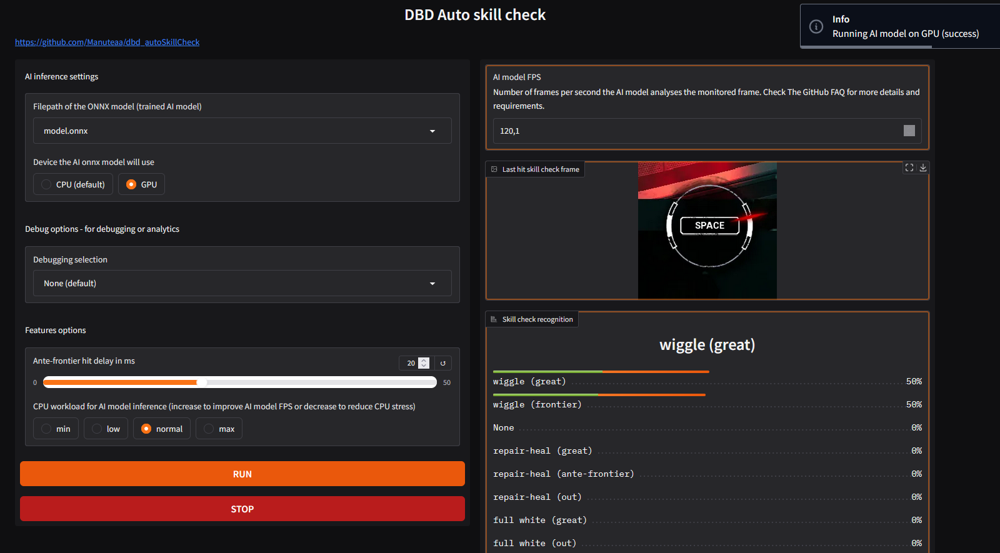
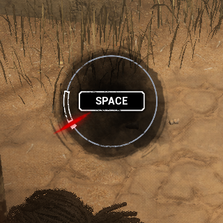
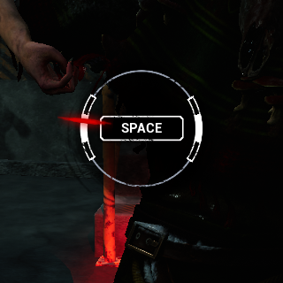
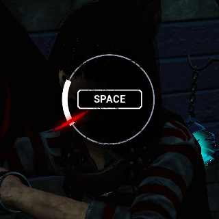
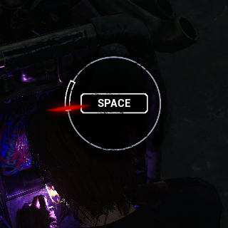

# Disclaimer

**This project is intended for research and educational purposes in the field of deep learning and how computer vision AI can help in video games.**

Using it may violate game rules and trigger anti-cheat detection. The author is not responsible for any consequences resulting from its use, this includes bans or any other unspecified violations. Use at your own risk. Join the [discord server](#acknowledgments) for more info.

# DBD Auto Skill Check

The Dead by Daylight Auto Skill Check is a tool developed using AI (deep learning with PyTorch) to automatically detect and successfully hit skill checks in the popular game Dead by Daylight. 
This tool is designed to demonstrate how AI can improve gameplay performance and enhance the player's success rate in the game. 

| Demo (x2 speed) |
|-------------------------------------------------------------------|
|                                    |

<!-- TOC -->
* [Disclaimer](#disclaimer)
* [DBD Auto Skill Check](#dbd-auto-skill-check)
* [Features](#features)
* [Execution Instructions](#execution-instructions)
  * [Get the code](#get-the-code)
    * [Python embedded app (RECOMMENDED)](#python-embedded-app-recommended)
    * [Build from source](#build-from-source)
    * [Windows compiled app](#windows-compiled-app)
  * [Auto skill-check Web UI](#auto-skill-check-web-ui)
* [Project details](#project-details)
  * [What is a skill check](#what-is-a-skill-check)
  * [Dataset](#dataset)
  * [Architecture](#architecture)
  * [Training](#training)
  * [Inference](#inference)
  * [Results](#results)
* [FAQ](#faq)
* [Acknowledgments](#acknowledgments)
<!-- TOC -->

# Features
- Real-time detection of skill checks (60fps)
- High accuracy of the AI model in recognizing **all types of skill checks (with a 98.7% precision, see details of [Results](#results))**
- Automatic triggering of great skill checks through auto-pressing the space bar
- A webUI to run the AI model
- A GPU mode and a slow-CPU-usage mode to reduce CPU overhead

# Execution Instructions

## Get the code

We provide a simple web interface to configure and run the AI model. When running, it will monitor a small portion of the selected screen and automatically hit the space bar when a great skill check is detected. The screen analysis is done in real time locally on your computer.
- [From the python embedded app](#python-embedded-app-recommended): Recommended and easiest way to run the AI model without installing anything.
- [From source](#build-from-source): Recommended if you want to customize the code or run it on GPU.
- [From the windows compiled app](#windows-compiled-app): A compiled package of the app. Just download & run the Windows `.exe`. Will be deprecated in the future for security reasons.

### Python embedded app (RECOMMENDED)

This is the recommended method to run the AI model. You don't need to install anything, and don't need any Python knowledge.

1) Go to the [releases page](https://github.com/Manuteaa/dbd_autoSkillCheck/releases) and go to the **latest** release (at least v3.0)
2) Download `dbd_autoSkillCheck.zip` and unzip it
3) Run `run_app.bat` (double click) to start the AI model web UI. You can safely run it (ignore the windows warning message). If you do not feel 100% comfortable with it, just read the content of the `.bat` file, copy and paste the single line in a terminal to run it manually.
4) Follow the [next instructions](#auto-skill-check-web-ui)

### Build from source

Use this method if you have some experience with Python and if you want to customize the code. This is also the only way to run the code using your GPU device (see [FAQ](#faq)).

1) Create your own python env (for example using python 3.12) 
2) Install the minimal necessary libraries using the command: `pip install numpy mss onnxruntime pyautogui IPython pillow gradio`
3) git clone the repo or download the source code (zip)
4) Run `python app.py` to start the AI model web UI
5) Follow the [next instructions](#auto-skill-check-web-ui)

### Windows compiled app

_Warning_: Some players reported that the compiled version `.exe` can cause EAC suspicious / ban, even in private games. That's why I recommend the two other execution methods, which are much safer to use. More details are available on the [Discord server](#acknowledgments).

1) Go to the [releases page](https://github.com/Manuteaa/dbd_autoSkillCheck/releases)
2) Download `standalone.zip` in an old release
3) Unzip the file
4) Run `app.exe` to start the AI model web UI
5) Follow the [next instructions](#auto-skill-check-web-ui)

## Auto skill-check Web UI

After having started the AI model web UI, a console will open, ctrl+click on the [local URL displayed in the console](http://127.0.0.1:7860) to open the local web UI.

1) Select the trained AI model (default to `model.onnx` available in this repo)
2) Select the device to use. Use default CPU device. GPU is only available using the [Build from source method](#build-from-source)
3) Select your monitor, and verify on the right panel that the displayed image matches the monitor where you will play the game. For best AI model performance, use a monitor with a resolution of 1920x1080
4) Configure additional features options (check the [FAQ](#faq) more for details)
5) Click **RUN**! It will now monitor your screen and hit the space bar for you
6) You can **STOP** and **RUN** the tool from the Web UI at will, for example when waiting in the game lobby

When running, your screen is monitored meaning that frames are regularly sampled (with a 224x224 center-crop) and analysed locally (on your computer) with our AI model. You can now play the game. When a great skill check is detected, the SPACE key is automatically pressed, then it waits for 0.5s to avoid triggering the same skill check multiple times in a row.

| Auto skill check example 1            | Auto skill check example 2            |
|---------------------------------------|---------------------------------------|
|  |  |

On the right of the web UI, we display :
- The AI model FPS : the number of frames per second the AI model processes
- The last hit skill check frame : last frame the AI model triggered the SPACE bar. **This may not be the actual hit frame (as registered by the game) because of game latency (such as ping). The AI model anticipates the latency, and hits the space bar a little bit before the cursor reaches the great area, that's why the displayed frame will always be few frames before actual game hit frame**
- Skill check recognition : set of probabilities for the frame displayed above

**Both the game AND the AI model FPS must run at 60fps (or more) in order to hit correctly the great skill checks.**

# Project details

## What is a skill check

A skill check is a game mechanic in Dead by Daylight that allows the player to progress faster in a specific action such as repairing generators or healing teammates.
It occurs randomly and requires players to press the space bar to stop the progression of a red cursor.

Skill checks can be: 
- failed, if the cursor misses the designated white zone (the hit area)
- successful, if the cursor lands in the white zone 
- or greatly successful, if the cursor accurately hits the white-filled zone 

Here are examples of different great skill checks:

|     Repair-Heal skill check     |       Wiggle skill check        |       Full white skill check        |        Full black skill check         |
|:-------------------------------:|:-------------------------------:|:-----------------------------------:|:-------------------------------------:|
|  |  |  |  |

Successfully hitting a skill check increases the speed of the corresponding action, and a greatly successful skill check provides even greater rewards. 
On the other hand, missing a skill check reduces the action's progression speed and alerts the ennemi with a loud sound.

## Dataset
We designed a custom dataset from in-game screen recordings and frame extraction of gameplay videos on youtube.
To save disk space, we center-crop each frame to size 320x320 before saving.

The data was manually divided into 11 separate folders based on :
- The visible skill check type : Repairing/healing, struggle, wiggle and special skill checks (overcharge, merciless storm, etc.) because the skill check aspects are different following the skill check type
- The position of the cursor relative to the area to hit : outside, a bit before the hit area and inside the hit area.

**We experimentally made the conclusion that following the type of the skill check, we must hit the space bar a bit before the cursor reaches the great area, in order to anticipate the game input processing latency.
That's why we have this dataset structure and granularity (with ante-frontier and frontier areas recognition).**

To alleviate the laborious collection task, we employed data augmentation techniques such as random rotations, random crop-resize, and random brightness/contrast/saturation adjustments.

We developed a customized and optimized dataloader that automatically parses the dataset folder and assigns the correct label to each image based on its corresponding folder.
Our data loaders use a custom sampler to handle imbalanced data.

## Architecture
The skill check detection system is based on an encoder-decoder architecture. 

We employ the MobileNet V3 Small architecture, specifically chosen for its trade-off between inference speed and accuracy. 
This ensures real-time inference and quick decision-making without compromising detection precision.
We also compared the architecture with the MobileNet V3 Large, but the accuracy gain was not worth a bigger model size (20Mo instead of 6Mo) and slower inference speed.

We had to manually modify the last layer of the decoder. Initially designed to classify 1000 different categories of real-world objects, we switched it to an 11-categories layer.

## Training

We use a standard cross entropy loss to train the model and monitor the training process using per-category accuracy score.

I trained the model using my own computer, and using the AWS _g6.4xlarge_ EC2 instance (around x1.5 faster to train than on my computer).

## Inference
We provide a script that loads the trained model and monitors the main screen.
For each sampled frame, the script will center-crop and normalize the image then feed it to the AI model.

Following the result of the skill check recognition, the script will automatically press the space bar to trigger the great skill check (or not), 
then it waits for a short period of time to avoid triggering the same skill check multiple times in a row.

To achieve real time results, we convert the model to ONNX format and use the ONNX runtime to perform inference. 
We observed a 1.5x to 2x speedup compared to baseline inference.

## Results

We test our model using a testing dataset of ~2000 images:

| Category Index | Category description        | Mean accuracy |
|----------------|-----------------------------|---------------|
| 0              | None                        | 100.0%        |
| 1              | repair-heal (great)         | 99.5%         |
| 2              | repair-heal (ante-frontier) | 96.5%         |
| 3              | repair-heal (out)           | 98.7%         |
| 4              | full white (great)          | 100%          |
| 5              | full white (out)            | 100%          |
| 6              | full black (great)          | 100%          |
| 7              | full black (out)            | 98.9%         |
| 8              | wiggle (great)              | 93.4%         |
| 9              | wiggle (frontier)           | 100%          |
| 10             | wiggle (out)                | 98.3%         |

During our laptop testing, we observed rapid inference times of approximately 10ms per frame using MobileNet V3 Small. 
When combined with our screen monitoring script, we achieved a consistent 60fps detection rate, which is enough for real-time detection capabilities.

In conclusion, our model achieves high accuracy thanks to the high-quality dataset with effective data augmentation techniques, and architectural choices.
**The RUN script successfully hits the great skill checks with high confidence.**

# FAQ

**What about the anti-cheat system ?**
- The script monitors a small crop of your main screen, processes it using an onnx model, and can press then release the space bar using [Windows MSDN](https://learn.microsoft.com/en-us/windows/win32/inputdev/virtual-key-codes?redirectedfrom=MSDN) once each 0.5s maximum. This win32 `SendInput` injection key can be considered as an "unfair advantage" by EAC, potentially leading to a ban. For this reason, the script should only be used in private games. However, if you still wish to use it in public matches, you can join the Discord server for more details. These specifics will not be shared publicly.

**How to run the AI model with your GPU (NVIDIA - CUDA)?**
- Uninstall `onnxruntime` then install `onnxruntime-gpu`
- Check onnxruntime-gpu version compatibilities with CUDA, CUDNN and torch https://onnxruntime.ai/docs/execution-providers/CUDA-ExecutionProvider.html#requirements
- Install [CUDA](https://developer.nvidia.com/cuda-downloads)
- Install [CUDNN](https://developer.nvidia.com/cudnn) matching your cuda version
- Install [torch](https://pytorch.org/get-started/locally/) with CUDA compute
- Select "GPU" in the Auto skill check webUI, click "RUN"
- Install last version of MSVC if you encounter an error

**How to run the AI model with your GPU (AMD - DirectML)**
- Uninstall `onnxruntime` then install `onnxruntime-directml`
- Select "GPU" in the Auto skill check webUI, click "RUN"

**Why do I hit good skill checks instead of great ? Be sure :**
- Your game FPS >= 60
- The AI model FPS >= 60
- Your ping is not too high (<= 60 should be fine)
- Use standard game settings (I recommend using 1080p at 100% resolution without any game filters, no vsync, no FSR)
- In the `Features options` of the WebUI, decrease (closer to 0) the `Ante-frontier hit delay` value

**I have lower values than 60 FPS for the AI model, what can I do ?**
- In the `Features options` of the WebUI, increase the `CPU workload` option
- Switch your resolution to 1920x1080 at 100% scale
- Switch device to gpu
- Run the script in administrator mode or with a higher priority in the task manager

**Why does the AI model hit the skill check too early and fail ?**
- In the `Features options` of the WebUI, increase the `Ante-frontier hit delay` value

**Does the script work well with the perk hyperfocus ?**
- Yes

# Acknowledgments

The project was made and is maintained by me ([Manuteaa](https://github.com/Manuteaa)). If you enjoy this project, consider giving it a ⭐! Starring the repository helps others discover it, and shows support for the work put into it. Your stars motivate me to add new features and address any bugs.

Feel free to open a new issue for any question, suggestion or issue. You can also join the discord server https://discord.gg/3mewehHHpZ for more info and help.

- A big thanks to [hemlock12](https://github.com/hemlock12) for the data collection help !
