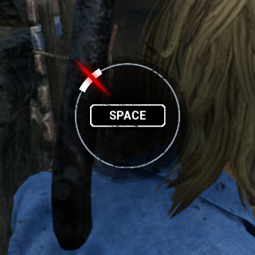

# DBD Auto Skill Check

The Dead by Daylight Auto Skill Check is a simple tool developed using deep learning techniques (PyTorch) to automatically detect and successfully hit skill checks in the popular game Dead by Daylight. 
This tool is designed to improve gameplay performance and enhance the player's skill in the game. 

## What is a skill check

A skill check is a game mechanic in Dead by Daylight that allows the player to progress faster in a specific action such as repairing generators or healing teammates.
It occurs randomly and requires players to press the space bar to stop the progression of a red cursor.

Skill checks can be categorized as failed (when the cursor misses the designated white zone), 
successful (when the cursor lands in the white zone), 
or greatly successful (when the cursor accurately hits a small, filled zone within the white zone). 
Successfully hitting a skill check increases the speed of the corresponding action, with a greatly successful skill check providing even greater rewards. 
Conversely, missing a skill check reduces the action's progression speed and alerts the killer with a loud sound.

Here are examples of different great skill checks:

|              Great skill check (type 1)              |              Great skill check (type 2)              |              Great skill check (type 3)              |
|:----------------------------------------------------:|:----------------------------------------------------:|:----------------------------------------------------:|
|  |  |  |

This tool works seamlessly with the perk "Hyperfocus," which provides additional rewards for great skill checks while making them more challenging.

## Dataset
We designed a custom dataset from in-game screen recording and frame extraction of gameplay videos on youtube.
To save disk space, we center-crop each frame to size 320x320 before saving.

The data was manually divided into three separate folders based on the following categories:
- Images without skill check
- Images with a skill check on hold (the skill check should not be hit yet)
- Images with a skill check to hit

To alleviate the laborious collection task, we employed data augmentation techniques such as random rotations, random crops, and random brightness/contrast/saturation adjustments.

## Dataloader
We developed a customized and optimized dataloader that automatically parses the dataset folder and assigns the correct label to each image based on its corresponding folder. 
Our custom dataloader includes several optional features:
- Pre-fetching of data
- Caching the dataset in RAM (the random transformations are not cached)
- Custom sampler to handle imbalanced data

## Architecture
The skill check detection system is based on an encoder-decoder architecture. 

The encoder employs the MobileNet V3 Large architecture, specifically chosen for its trade-off between inference speed and accuracy. 
This ensures real-time inference and quick decision-making without compromising detection precision.

The decoder is a simple MLP with a single hidden layer. The MLP predicts three logits, providing the valuable information for the decision-making.

## Training
We use a standard cross entropy loss combined with a L2 regularization loss to train the model.

## Inference
We provide a script that loads the trained model and monitors your screen.
For each sampled frame, the script will center-crop and normalize the image then feed it to the model.

When a skill check is detected, the script will automatically press the space bar to trigger the great skill check, 
then it waits for a short period of time (5s) to avoid triggering the same skill check multiple times in a row.

## Features
- Real-time detection of skill checks
- High accuracy in recognizing skill checks
- Automatic triggering of great skill checks through auto-pressing the space bar
- Not detected as a cheat since it's a Python script that doesn't modify any game files

## Results

| Encoder architecture | Great skill check precision | Great skill check recall | FPS for inference |
|:--------------------:|:---------------------------:|:------------------------:|:-----------------:|
|  MobileNet v3 Large  |              x              |            x             |         x         |
|       ConvNext       |              x              |            x             |         x         |

Conclusion
