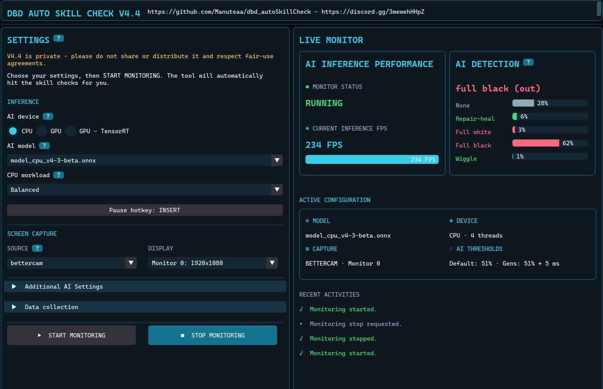
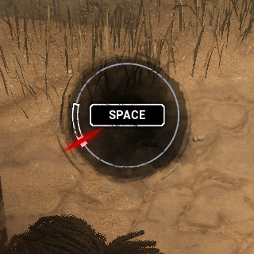
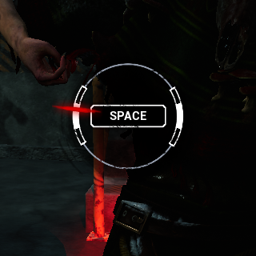
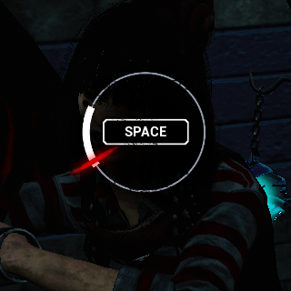
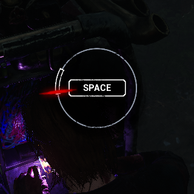

# DBD Auto Skill Check

_DBD Auto Skill Check_ is an AI research project that detects and automatically hits great skill checks in Dead by Daylight using AI.

Our application provides a desktop interface for configuring and running our AI model **on your computer** (no internet). While active, it monitors a small area of the screen (224x224 area) and automatically presses the space bar when it detects a great skill check.

The project uses PyTorch for training and ONNX Runtime for real-time inference, with optional GPU support. It demonstrates how computer vision models can operate within the latency constraints of a multiplayer game.

| Demo (2x speed)                 |
|---------------------------------|
|  |



## Disclaimer

> Using it may violate the game's rules or trigger anti-cheat detection. The author is not responsible for any resulting consequences, including bans or other penalties. Use it at your own risk.

> This software is licensed under the GNU General Public License v3.0. If you distribute a modified or compiled version, you must retain attribution, provide the GPLv3 license, and make the corresponding source code available under the same license. See [LICENSE](LICENSE).

## Installation


**This open-source version provides limited functionalities and a lighter AI model (slightly less accurate) intended for testing in private matches, youtube videos or a [skill checks simulator](https://dbd.lucaservers.com/). To access the full application, join the [Discord server](#acknowledgments) and accept the fair-use agreement.**


### Embedded Python application

This is the recommended option. It does not require Python knowledge.

1. Go to the [releases page](https://github.com/Manuteaa/dbd_autoSkillCheck/releases) and open the latest release. It is a minimal package to run the app.
2. Download and extract `DBD-ASC-V4.0-GH.zip`.
3. Double-click `run_app.bat`. You may ignore the Windows warning related to "unknown publisher".

### Build from source

Choose this option if you are familiar with Python and want to customize the code.

1. Create a Python 3.12 environment.
2. Clone the repository.
3. Install the minimum dependencies:

   ```text
   dearpygui mss numpy Pillow pynput onnxruntime
   ```


4. Run `dbd/app.py` to start the application.


## Project details

### What is a skill check?

Skill checks are timed inputs required during some actions like repairing or healing.
It occurs randomly and requires players to press the space bar to stop the progression of a red cursor.

Possible outcomes:
- **Fail:** cursor misses the zone (penalize progress and alert enemy)
- **Success:** cursor hits a highlighted zone
- **Great success:** cursor hits the optional white small area (provide high rewards)

| Repair/heal skill check      | Wiggle skill check            | Full white skill check           | Full black skill check             |
|:----------------------------:|:-----------------------------:|:--------------------------------:|:----------------------------------:|
|  |   |  |  |

### Dataset

- Built from in-game recordings and YouTube gameplay
- Frames center-cropped to 320×320
- Manually categorized by:
  - Skill check type
  - Cursor position relative to the hit zone

To reduce the manual collection effort, the training data was augmented with random rotations, crop-and-resize operations, and brightness, contrast, and saturation adjustments.

| Class | Description            |
|------:|------------------------|
| 0     | None                   |
| 1     | Repair/heal (great)    |
| 2     | Repair/heal (frontier) |
| 3     | Repair/heal (out)      |
| 4     | Full white (great)     |
| 5     | Full white (out)       |
| 6     | Full black (great)     |
| 7     | Full black (out)       |
| 8     | Wiggle (great)         |
| 9     | Wiggle (out)           |

### Architecture

We use the **ShuffleNet V2 X0.5 architecture**, specifically chosen for the real-time inference requirement. We had to manually modify the last layer of the decoder. Initially designed to classify 1000 different categories of real-world objects, we switched it to an 10-categories layer.

### Training

The model is trained with **focal loss**, which addresses class imbalance by placing more emphasis on hard-to-classify examples. Training is monitored using precision and recall for each category.

L1 regularization is also applied. During analysis, the models were found to contain many denormal values. L1 regularization significantly reduced these values and improved performance.

The best model is selected using the highest **F1 score**, averaged equally across all categories.

### Inference and results

The model is deployed with **ONNX Runtime**, which provides optimized inference across different hardware configurations.

| Architecture       | Mean inference speed (ONNX, CPU 1 thread) | Mean accuracy | ONNX model size |
|--------------------|-------------------------------------------|---------------|-----------------|
| ShuffleNet V2 X0.5 | 180 frames/s                              | 98.67%        | 1.4 MB          |
| MobileNet V3 Small | 110 frames/s                              | 99.42%        | 6.1 MB          |
| MobileNet V3 Large | 30 frames/s                               | 99.94%        | 20 MB           |


## Acknowledgments

This project is created and maintained by [Manuteaa](https://github.com/Manuteaa). If you find it useful, consider giving the repository a ⭐. It helps others discover the project and supports its continued development.

For questions, suggestions, or bug reports, feel free to open an issue. You can also join the [Discord server](https://discord.gg/3mewehHHpZ) for information and support.

- Special thanks to [hemlock12](https://github.com/hemlock12) and Stormo for helping with data collection.
- Thanks to Aaron for helping with the Discord server.
