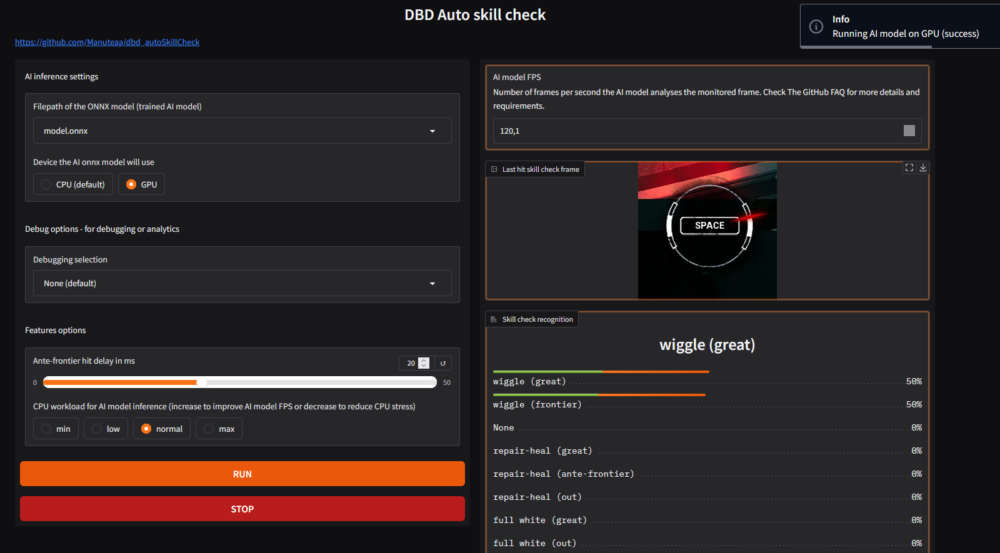

# Disclaimer

**This project is intended for research and educational purposes in the field of deep learning and how computer vision AI can help in video games.**

Using it may violate game rules and trigger anti-cheat detection. The author is not responsible for any consequences resulting from its use, this includes bans or any other unspecified violations. Use at your own risk. Join the [discord server](#acknowledgments) for more details about how to test it, after accepting the fair-use agreement.

You are free to use or modify this software, but you must strictly adhere to the terms of the GNU General Public License v3.0 (GPLv3).
If you are distributing or selling a compiled version of this tool, you must:
1. State clearly that it is based on this repository and include the original copyright notice.
2. Provide a copy of the GPLv3 license to your users.
3. Make the full source code available to anyone you distribute it to, under the exact same GPLv3 license.

Taking this code, closing the source, stripping the attribution, and selling it as your own proprietary software is a direct violation of the license and copyright law.

# DBD Auto Skill Check

The Dead by Daylight Auto Skill Check is a tool developed using AI (deep learning with PyTorch) to automatically detect and successfully hit skill checks in the popular game Dead by Daylight.
This tool is designed to demonstrate how AI can improve gameplay performance and enhance the player's success rate in the game.

| Demo (x2 speed)                 |
| ------------------------------- |
|  |

<!-- TOC -->

- [Disclaimer](#disclaimer)
- [DBD Auto Skill Check](#dbd-auto-skill-check)
- [Features](#features)
- [Platform Support](#platform-support)
- [Execution Instructions](#execution-instructions)
  - [Get the code](#get-the-code)
    - [Python embedded app](#python-embedded-app)
    - [Build from source](#build-from-source)
  - [Auto skill-check Web UI](#auto-skill-check-web-ui)
  - [Terminal UI (TUI)](#terminal-ui-tui)
- [Screen Capture Methods](#screen-capture-methods)
- [FPS Presets & Ante-Frontier Delay](#fps-presets--ante-frontier-delay)
- [Linux Setup Guide](#linux-setup-guide)
- [Project details](#project-details)
  - [What is a skill check](#what-is-a-skill-check)
  - [Dataset](#dataset)
  - [Architecture](#architecture)
  - [Training](#training)
  - [Inference](#inference)
  - [Results](#results)
- [FAQ](#faq)
- [Acknowledgments](#acknowledgments)
<!-- TOC -->

# Features

- Real-time detection of skill checks (120fps)
- High accuracy of the AI model in recognizing **all types of skill checks (with a 98.7% precision, see details of [Results](#results))**
- Automatic triggering of great skill checks through auto-pressing the space bar
- **Web UI** (Gradio) and **Terminal UI** (rich) to run the AI model
- **Cross-platform**: Works on Windows, Linux (X11), and Linux (Wayland via OBS VirtualCam)
- **FPS Presets**: Quick configuration for 60/90/120+ FPS game settings
- **Ante-frontier delay**: Configurable from -300ms to +50ms for fine-tuned timing
- A GPU mode and a slow-CPU-usage mode to reduce CPU overhead

What's in the **beta V4 release** (only available in the discord server for now):

- A brand-new **AI model trained on updated data**, offering improved accuracy and supporting perks: 1, 2, 3, 4 / Decisive Strike / Oppression. Add-on: Brand New Part
- A lighter CPU-optimized version of the AI model (1.5 MB) using 8-bit integer quantization
- A GPU-optimized version of the AI model (6 MB) using CUDA or cuML
- A new user interface
- A simpler, more accessible way to enable GPU mode
- Some options to customize the AI settings, especially helpful for older hardware

# Platform Support

| Platform            | Status          | Screen Capture Methods  | Input Method                 |
| ------------------- | --------------- | ----------------------- | ---------------------------- |
| **Windows**         | ✅ Full support | `mss`, `bettercam`      | Win32 SendInput              |
| **Linux (X11)**     | ✅ Full support | `mss`                   | Kernel (`evdev`) or `pynput` |
| **Linux (Wayland)** | ⚠️ Limited      | `v4l2 (OBS VirtualCam)` | Kernel (`evdev`) or `pynput` |

> **Wayland users**: Direct screen capture (`mss`) does not work on Wayland. You must use OBS Virtual Camera as a workaround. See the [Linux Setup Guide](#linux-setup-guide) for instructions.

# Execution Instructions

## Get the code

We provide two interfaces to configure and run the AI model:

- **Web UI** (`app.py`): Browser-based interface powered by Gradio
- **Terminal UI** (`tui.py`): Terminal-based interface powered by Rich

Both will monitor a small portion of the selected screen and automatically hit the space bar when a great skill check is detected. The screen analysis is done in real time locally on your computer.

### Python embedded app

This is the recommended method for Windows users. You don't need to install anything, and don't need any Python knowledge.

1. Go to the [releases page](https://github.com/Manuteaa/dbd_autoSkillCheck/releases) and go to the **latest** release (at least v3.0)
2. Download `dbd_autoSkillCheck.zip` and unzip it
3. Run `run_app.bat` (double click) to start the AI model web UI. You can safely run it (ignore the windows warning message). If you do not feel 100% comfortable with it, just read the content of the `.bat` file, copy and paste the single line in a terminal to run it manually.
4. Follow the [next instructions](#auto-skill-check-web-ui)

### Build from source

Use this method if you have some experience with Python and if you want to customize the code. This is also the only way to run the code using your GPU device (see [FAQ](#faq)).

**Windows:**

```bash
# 1. Create virtual environment
python -m venv venv
venv\Scripts\activate

# 2. Install dependencies
pip install -r requirements.txt

# 3. Run Web UI or Terminal UI
python app.py    # Web UI
python tui.py    # Terminal UI
```

**Linux:**

```bash
# 1. Create virtual environment
python3 -m venv venv
source venv/bin/activate

# 2. Install dependencies
pip install -r requirements.txt

# 3. Run Web UI or Terminal UI
python app.py    # Web UI
python tui.py    # Terminal UI

# Quick start (skip settings)
./start.sh
```

## Auto skill-check Web UI

After having started the AI model web UI (`python app.py`), a console will open, ctrl+click on the [local URL displayed in the console](http://127.0.0.1:7860) to open the local web UI.

1. Select the trained AI model (default to `model.onnx` available in this repo)
2. Select the device to use. Use default CPU device. GPU is only available using the [Build from source method](#build-from-source)
3. Select the **screen capture method** (auto-detected based on your platform):
   - **Windows**: `bettercam` (high performance) or `mss` (fallback)
   - **Linux X11**: `mss`
   - **Linux Wayland**: `v4l2 (OBS VirtualCam)` — see [Linux Setup Guide](#linux-setup-guide)
4. Select your monitor / capture source, and verify on the right panel that the displayed image matches the monitor where you will play the game. For best AI model performance, use a monitor with a resolution of 1920x1080
5. Choose an **FPS Preset** to auto-configure the ante-frontier delay, or set it manually
6. Click **RUN**! It will now monitor your screen and hit the space bar for you
7. You can **STOP** and **RUN** the tool from the Web UI at will, for example when waiting in the game lobby

> 💡 **Tip**: Hover over any setting label in the Web UI to see a detailed explanation of what it does.

## Terminal UI (TUI)

The Terminal UI is a lightweight alternative to the Web UI. No browser needed.

```bash
# Interactive settings
python tui.py

# Quick start with defaults (skip settings menu)
python tui.py -s

# Linux quick-start script
./start.sh
```

**Features:**

- Live FPS counter and hit statistics
- Real-time AI prediction probability display
- Interactive settings menu with FPS presets
- Session summary on exit

| Auto skill check example 1            | Auto skill check example 2            |
| ------------------------------------- | ------------------------------------- |
|  |  |

On the right of the web UI, we display :

- The AI model FPS : the number of frames per second the AI model processes
- The last hit skill check frame : last frame the AI model triggered the SPACE bar. **This may not be the actual hit frame (as registered by the game) because of game latency (such as ping). The AI model anticipates the latency, and hits the space bar a little bit before the cursor reaches the great area, that's why the displayed frame will always be few frames before actual game hit frame**
- Skill check recognition : set of probabilities for the frame displayed above

**Both the game AND the AI model FPS must run at a minimum of 60fps in order to hit correctly the great skill checks.**

# Screen Capture Methods

| Method                  | Platform             | Performance | Description                                                                                                                                                             |
| ----------------------- | -------------------- | ----------- | ----------------------------------------------------------------------------------------------------------------------------------------------------------------------- |
| `mss`                   | Windows, Linux (X11) | ⭐⭐⭐⭐    | Cross-platform screen capture. Works on Windows and Linux X11. **Does NOT work on Wayland.**                                                                            |
| `bettercam`             | Windows only         | ⭐⭐⭐⭐⭐  | High-performance Windows-only screen capture using DXGI Desktop Duplication. Recommended for Windows.                                                                   |
| `v4l2 (OBS VirtualCam)` | Linux                | ⭐⭐⭐      | Captures from OBS Virtual Camera. Works on both X11 and Wayland. Requires OBS Studio with Virtual Camera enabled. This is the **recommended method for Wayland users**. |

> **Note**: The Web UI auto-detects your platform and selects the best default method. You can always change it manually.

# FPS Presets & Ante-Frontier Delay

The ante-frontier delay determines how early or late the AI presses the space bar relative to detecting the skill check. The optimal value depends on your game's FPS:

| FPS Preset          | Ante-Frontier Delay | Description                                               |
| ------------------- | ------------------- | --------------------------------------------------------- |
| **60 FPS (locked)** | -250ms              | Press much earlier to compensate for slower frame updates |
| **90 FPS**          | -125ms              | Moderate early press                                      |
| **120+ FPS**        | 0ms                 | No compensation needed, frame updates are fast enough     |
| **Custom**          | -300ms to +50ms     | Manual fine-tuning for your specific setup                |

**How it works:**

- **Negative values** = press EARLIER (compensates for input lag at lower FPS)
- **Positive values** = press LATER (for very high FPS or to fine-tune timing)
- **0** = press at the exact moment the AI detects the great zone

> **💡 Tip**: Start with the preset matching your game FPS. If you're hitting "good" instead of "great", try decreasing the value (more negative). If you're hitting too early and failing, increase the value.

# Human-Like Input Simulation

To avoid detection by anti-cheat systems (like EAC), the tool now includes a sophisticated **Humanizer** module that makes key presses look natural and unique to every user.

### 🛡️ Per-Installation Fingerprinting

Every installation generates a unique `humanizer_fingerprint.json` file on the first run. This file contains randomized timing parameters (within human limits) specific to **your** setup.

- **Result:** Your bot's timing pattern is mathematically distinct from every other user's.
- **Benefit:** Anti-cheat systems cannot cluster users based on identical timing signatures.

### 🎭 Natural Variance & Hesitation

Instead of mechanical, fixed delays, the Humanizer uses:

- **Ex-Gaussian Distribution:** Matches scientific models of human reaction time (skewed distribution).
- **Micro-Hesitations:** Optional ~7% chance to delay the press slightly (15-50ms), mimicking real human hesitation.
- **Fatigue System:** Reaction times gradually slow down (up to 15%) over long sessions.
- **Anti-Repeat Jitter:** Prevents two consecutive key presses from having the exact same duration.

> **Note:** "Human-like Hesitation" is enabled by default for maximum safety. It may rarely cause a "Good" skill check instead of "Great", but it significantly reduces the risk of detection. You can disable it in the Web UI or TUI if you prefer mechanical precision.

### 🐧 Linux Kernel-Level Input (Maximum Safety)

On Linux systems, this tool can use a **Polymorphic Kernel Driver** to inject key presses directly into the OS kernel.

- **How it works:** Creates a virtual input device (`/dev/uinput`) that mimics real hardware (e.g., Logitech/Razer keyboards).
- **Polymorphism:** On every launch, it randomly selects a different Vendor ID, Product ID, and Device Name to prevent device blacklisting.
- **Safety:** To Anti-Cheat systems, inputs appear to come from a physical USB device, bypassing `LLKHF_INJECTED` flags used to detect software macros.
- **Requirement:** User must have permissions to write to `/dev/uinput` (see Setup Guide below).

# Linux Setup Guide

## X11 Users

Linux X11 works out of the box with `mss` screen capture:

```bash
python3 -m venv venv
source venv/bin/activate
pip install -r requirements.txt
python app.py   # or python tui.py
```

## Wayland Users (KDE Plasma, GNOME, Sway, etc.)

Wayland does NOT allow direct screen capture for security reasons. You need to use **OBS Virtual Camera** as a workaround:

### Step 1: Install OBS Studio

```bash
# Debian/Ubuntu
sudo apt install obs-studio

# Fedora
sudo dnf install obs-studio

# Arch Linux
sudo pacman -S obs-studio
```

### Step 2: Install v4l2loopback (if not already installed)

```bash
# Debian/Ubuntu
sudo apt install v4l2loopback-dkms

# Fedora
sudo dnf install v4l2loopback

# Arch Linux
sudo pacman -S v4l2loopback-dkms
```

### Step 3: Configure OBS

1. Open OBS Studio
2. Add a **Window Capture** or **Screen Capture** source for your game
3. Make sure the game window fills the entire canvas
4. Click **Start Virtual Camera** at the bottom of OBS

### Step 4: Run the tool

```bash
source venv/bin/activate
python app.py   # Select "v4l2 (OBS VirtualCam)" as capture method
# or
python tui.py   # Select "v4l2 (OBS VirtualCam)" in settings
```

> ⚠️ **Wayland Limitations**: Since capture goes through OBS, there is a slight additional latency compared to direct capture methods. OBS itself should run at your monitor's refresh rate for best results.

### Required packages for Linux

```bash
pip install pynput    # Standard input (fallback)
pip install evdev     # Kernel-level input (Safe Mode)
```

### Enabling Safe Mode (Kernel Input)

To use the Kernel-Level Input (Safe Mode), your user needs permission to create virtual devices:

1. **Add your user to the `input` group** (or creates a udev rule):

   ```bash
   sudo groupadd -f input
   sudo usermod -aG input $USER
   ```

2. **Create a udev rule** to allow access to `/dev/uinput`:

   ```bash
   echo 'KERNEL=="uinput", GROUP="input", MODE="0660"' | sudo tee /etc/udev/rules.d/99-input.rules
   ```

3. **Reload rules and reboot** (or re-login):
   ```bash
   sudo udevadm control --reload-rules && sudo udevadm trigger
   # You usually need to logout/login or reboot for group changes to take effect
   ```

If configured correctly, the TUI will show **`Input Mode: Linux Kernel (Safe)`**. If not, it will fallback to `User (Standard)`.

# Project details

## What is a skill check

A skill check is a game mechanic in Dead by Daylight that allows the player to progress faster in a specific action such as repairing generators or healing teammates.
It occurs randomly and requires players to press the space bar to stop the progression of a red cursor.

Skill checks can be:

- failed, if the cursor misses the designated white zone (the hit area)
- successful, if the cursor lands in the white zone
- or greatly successful, if the cursor accurately hits the white-filled zone

Here are examples of different great skill checks:

|     Repair-Heal skill check     |       Wiggle skill check        |       Full white skill check        |        Full black skill check         |
| :-----------------------------: | :-----------------------------: | :---------------------------------: | :-----------------------------------: |
|  |  |  |  |

Successfully hitting a skill check increases the speed of the corresponding action, and a greatly successful skill check provides even greater rewards.
On the other hand, missing a skill check reduces the action's progression speed and alerts the ennemi with a loud sound.

## Dataset

We designed a custom dataset from in-game screen recordings and frame extraction of gameplay videos on youtube.
To save disk space, we center-crop each frame to size 320x320 before saving.

The data was manually divided into 11 separate folders based on :

- The visible skill check type : Repairing/healing, struggle, wiggle and special skill checks (overcharge, merciless storm, etc.) because the skill check aspects are different following the skill check type
- The position of the cursor relative to the area to hit : outside, a bit before the hit area and inside the hit area.

**We experimentally made the conclusion that following the type of the skill check, we must hit the space bar a bit before the cursor reaches the great area, in order to anticipate the game input processing latency.
That's why we have this dataset structure and granularity (with ante-frontier and frontier areas recognition).**

To alleviate the laborious collection task, we employed data augmentation techniques such as random rotations, random crop-resize, and random brightness/contrast/saturation adjustments.

We developed a customized and optimized dataloader that automatically parses the dataset folder and assigns the correct label to each image based on its corresponding folder.
Our data loaders use a custom sampler to handle imbalanced data.

## Architecture

The skill check detection system is based on an encoder-decoder architecture.

We employ the MobileNet V3 Small architecture, specifically chosen for its trade-off between inference speed and accuracy.
This ensures real-time inference and quick decision-making without compromising detection precision.
We also compared the architecture with the MobileNet V3 Large, but the accuracy gain was not worth a bigger model size (20Mo instead of 6Mo) and slower inference speed.

We had to manually modify the last layer of the decoder. Initially designed to classify 1000 different categories of real-world objects, we switched it to an 11-categories layer.

## Training

We use a standard cross entropy loss to train the model and monitor the training process using per-category accuracy score.

I trained the model using my own computer, and using the AWS _g6.4xlarge_ EC2 instance (around x1.5 faster to train than on my computer).

## Inference

We provide a script that loads the trained model and monitors the main screen.
For each sampled frame, the script will center-crop and normalize the image then feed it to the AI model.

Following the result of the skill check recognition, the script will automatically press the space bar to trigger the great skill check (or not),
then it waits for a short period of time to avoid triggering the same skill check multiple times in a row.

To achieve real time results, we convert the model to ONNX format and use the ONNX runtime to perform inference.
We observed a 1.5x to 2x speedup compared to baseline inference.

## Results

We test our model using a testing dataset of ~2000 images:

| Category Index | Category description        | Mean accuracy |
| -------------- | --------------------------- | ------------- |
| 0              | None                        | 100.0%        |
| 1              | repair-heal (great)         | 99.5%         |
| 2              | repair-heal (ante-frontier) | 96.5%         |
| 3              | repair-heal (out)           | 98.7%         |
| 4              | full white (great)          | 100%          |
| 5              | full white (out)            | 100%          |
| 6              | full black (great)          | 100%          |
| 7              | full black (out)            | 98.9%         |
| 8              | wiggle (great)              | 93.4%         |
| 9              | wiggle (frontier)           | 100%          |
| 10             | wiggle (out)                | 98.3%         |

During our laptop testing, we observed rapid inference times of approximately 10ms per frame using MobileNet V3 Small.
When combined with our screen monitoring script, we achieved a consistent 120fps detection rate, which is enough for real-time detection capabilities.

In conclusion, our model achieves high accuracy thanks to the high-quality dataset with effective data augmentation techniques, and architectural choices.
**The RUN script successfully hits the great skill checks with high confidence.**

# FAQ

**What about the anti-cheat system ?**

- The script monitors a small crop of your main screen, processes it using an onnx model, and can press then release the space bar using [Windows MSDN](https://learn.microsoft.com/en-us/windows/win32/inputdev/virtual-key-codes?redirectedfrom=MSDN) (or pynput on Linux) once each 0.5s maximum. This key press injection can be considered as an "unfair advantage" by EAC, potentially leading to a ban. For this reason, the script should only be used in private games. However, if you still wish to use it in public matches, you can join the Discord server for more details. These specifics will not be shared publicly and will only be available after accepting the fair-use agreement.

**How to run on Linux?**

- Install dependencies: `pip install -r requirements.txt`
- For X11: run `python app.py` or `python tui.py` — `mss` capture works out of the box
- For Wayland: install OBS Studio, start Virtual Camera, then select `v4l2 (OBS VirtualCam)` as the capture method. See the [Linux Setup Guide](#linux-setup-guide)

**How to use the Terminal UI?**

- Run `python tui.py` for interactive settings, or `python tui.py -s` for quick start with defaults
- On Linux: `./start.sh` for quick launch
- On Windows: double-click `start.bat`

**What are FPS Presets?**

- FPS presets auto-configure the ante-frontier delay based on your game's frame rate. At lower FPS (60), the AI needs to press earlier (-250ms) to compensate for slower frame updates. At higher FPS (120+), no compensation is needed (0ms). See [FPS Presets & Ante-Frontier Delay](#fps-presets--ante-frontier-delay) for details.

**How to run the AI model with your GPU (NVIDIA - CUDA)?**

- Uninstall `onnxruntime` then install `onnxruntime-gpu`
- Check onnxruntime-gpu version compatibilities with CUDA, CUDNN and torch https://onnxruntime.ai/docs/execution-providers/CUDA-ExecutionProvider.html#requirements
- Install [CUDA](https://developer.nvidia.com/cuda-downloads)
- Install [CUDNN](https://developer.nvidia.com/cudnn) matching your cuda version
- Install [torch](https://pytorch.org/get-started/locally/) with CUDA compute
- Select "GPU" in the Auto skill check webUI, click "RUN"
- Install last version of MSVC if you encounter an error
- _Note for advanced users: We also provide a tensorRT model support. Install the necessary tensorRT libs, convert the .onnx model into an optimized .trt model and select it with GPU mode from the WebUI._

**How to run the AI model with your GPU (AMD - DirectML)**

- Install torch with CPU compute `pip install torch`
- Uninstall `onnxruntime` then install `onnxruntime-directml`
- Select "GPU" in the Auto skill check webUI, click "RUN"

**Why do I hit good skill checks instead of great ?**

- Best performance is achieved when both the game and the AI model run around 120fps (or more).
- Try a different **FPS Preset** — if your game runs at 60fps, use the "60 FPS" preset
- Check if your ping is not too high
- Disable all your game filters/reshade, disable vsync and disable FSR
- Manually decrease the `Ante-frontier hit delay` value for finer control

**I want to increase the AI model FPS, what can I do ?**

- Use performance mode on your battery settings
- Run the app with a higher priority in the task manager
- Close all unnecessary applications running in the background and decrease the game graphics settings
- In the `Features options` of the WebUI, increase the `CPU workload`. Note that you should adapt the value depending on your hardware, because highest values can lower performance on low-end CPU.
- Set both your monitor & game resolution to 1920x1080 at 100% scale
- Increase all your monitors refresh rate (120Hz for example)
- Switch device to gpu

**Why does the AI model hit the skill check too early and fail ?**

- In the `Features options` of the WebUI, increase (closer to 0) the `Ante-frontier hit delay` value

**Does the script work well with the perk hyperfocus ?**

- Yes

**How to fix the error `[ONNXRuntimeError] : 7 : INVALID_PROTOBUF : Load model from models/model.onnx failed:Protobuf parsing failed.` ?**

- Sometimes Github downloads an empty .onnx file (with a size of 0ko or 1ko in the folder `models/`). Just re-download the [file](https://github.com/Manuteaa/dbd_autoSkillCheck/blob/main/models/model.onnx) and replace the empty one with the one you just downloaded.

# Acknowledgments

The project was made and is maintained by [Manuteaa](https://github.com/Manuteaa). If you enjoy this project, consider giving it a ⭐! Starring the repository helps others discover it, and shows support for the work put into it. Your stars motivate me to add new features and address any bugs.

**Contributors:**

- Linux support, Terminal UI, FPS Presets, and Wayland (OBS) support by [quirxsama](https://github.com/quirxsama)

Feel free to open a new issue for any question, suggestion or issue. You can also join the discord server https://discord.gg/3mewehHHpZ for more info and help.

- A big thanks to [hemlock12](https://github.com/hemlock12) for the data collection help !
- Thanks to Aaron for the big help with the discord server !
